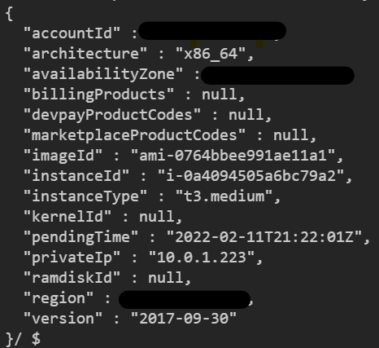

# Kubernets
Getting the instance-indentity document.

## About the program

1. Created a VPC with 4 subnets, 2 public, 2 private, and did all the routing.

2. Created an EKS cluster with IAM and SG policies.

3. Created a group of managed nodes on spot instances

4. Made a screenshot of the curl command: `curl http://169.254.169.254/latest/dynamic/instance-identity/document`.

## How to start the program?

The program has been released with two states: VPC+EKS and Curl_pod (it is possible to use this state for multiple pods).

* Go to the __eks__ folder and execute the following commands:
  `terragrunt plan` - required to download all necessary modules and establish a connection to S3+DynamoDB.  
  `terragrunt apply --auto-approve` - apply the structure to the AWS account.
* Go to the __pods__ folder and run the same commands as above. This will help you create the curl pod.
* Then you need to update the configuration locally: `aws eks update-kubeconfig --region <your_region> --name <cluster_name>` and you can check the list of existing pods: `kubectl get pods`. As a result you will see a curl pod.
* You execute the command: `kubectl exec -it curl sh` to enter. And as a result you execute desired curl command inside (`curl http://169.254.169.254/latest/dynamic/instance-identity/document`).

## Screenshot (output of the curl command)
